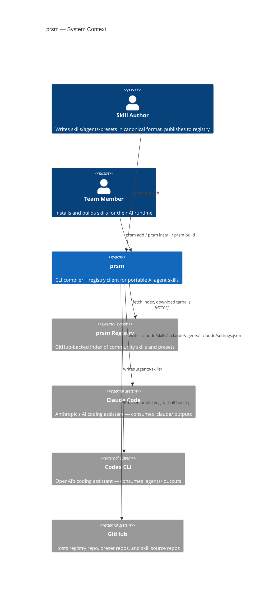
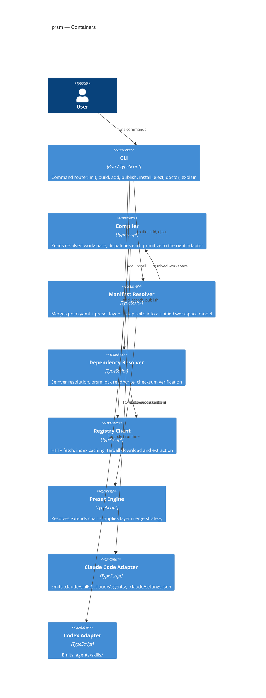

# 01 — System Overview

## System Context (C4 Level 1)

Who interacts with prsm and what external systems it touches.

## Container Diagram (C4 Level 2)

Internal components of the prsm CLI.

## Key Invariants

- **Source of truth is the workspace.** `prsm.yaml` + `prsm.lock` + `skills/` fully describe the build. Runtime outputs (`.claude/`, `.agents/`) are derived artifacts and can be regenerated at any time.
- **Lockfile pins exact versions.** `prsm build` never re-resolves from the registry. It always uses what `prsm.lock` says.
- **Project-local always beats global.** Both Claude Code and Codex resolve project-local dirs before `~/.claude/skills/` or global installs. prsm only writes to project-local dirs.
- **Adapters are the only runtime-specific code.** All authoring primitives (SKILL.yaml, AGENT.yaml, hooks) are runtime-agnostic. Only adapters know the target format.
