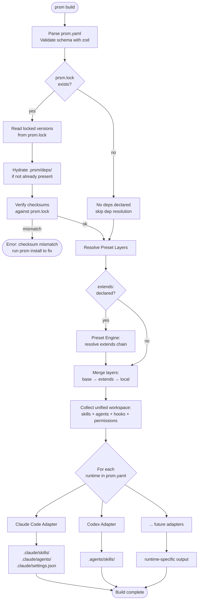
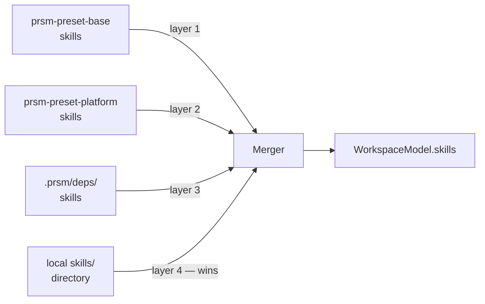

# 02 — Compilation Model

`prsm build` is the core operation. It reads the workspace manifest, resolves all sources (local skills, deps, preset layers), and dispatches to runtime adapters to emit outputs.

## Build Pipeline



## Workspace Model

Before dispatching to adapters, the compiler builds a unified in-memory model:

```
WorkspaceModel {
  name: string
  version: string
  runtimes: string[]
  skills: ResolvedSkill[]     // local + from deps + from presets, merged
  agents: ResolvedAgent[]
  hooks: ResolvedHooks
  permissions: ResolvedPermissions
}

ResolvedSkill {
  name: string
  category: string
  version: string
  content: string             // SKILL.md content
  metadata: SkillMetadata     // parsed SKILL.yaml
  origin: "local" | "dep" | "preset"
  originDetail: string        // path or package@version
}
```

## Skill Resolution Order

When the same skill name appears in multiple sources, last-wins applies:



`prsm explain <skill-name>` shows which layer a skill came from and why.

## Output Directory Structure

### Claude Code adapter output

```
.claude/
  skills/
    hub-platform-copilot/
      SKILL.md              # compiled from skills/platform/copilot/SKILL.md
    hub-security-stride/
      SKILL.md
    superpowers/            # from dep prsm.lock: superpowers@5.1.0
      using-superpowers/
        SKILL.md
  agents/
    pr-reviewer.md          # compiled from agents/pr-reviewer/AGENT.md
  settings.json             # hooks + permissions generated from prsm.yaml
```

### Codex adapter output

```
.agents/
  skills/
    hub-platform-copilot/
      SKILL.md
    hub-security-stride/
      SKILL.md
```

## Incremental Builds

`prsm build` is idempotent — running it multiple times produces identical output. Output dirs are wiped and rewritten on each build to prevent stale artifacts from lingering.
