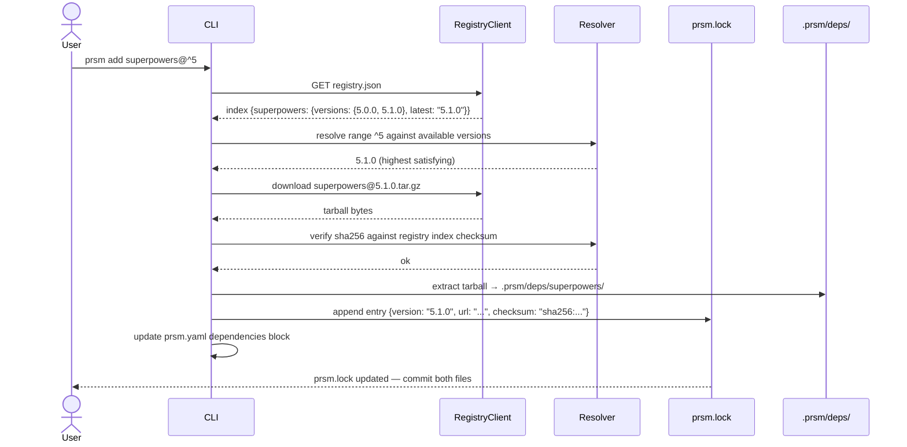
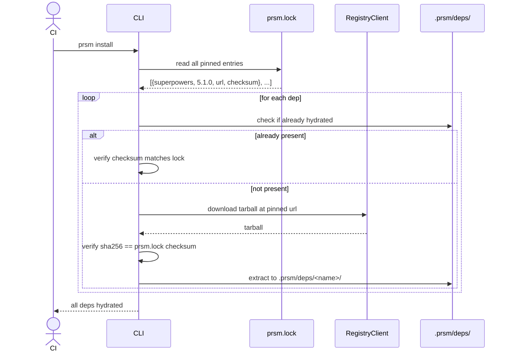
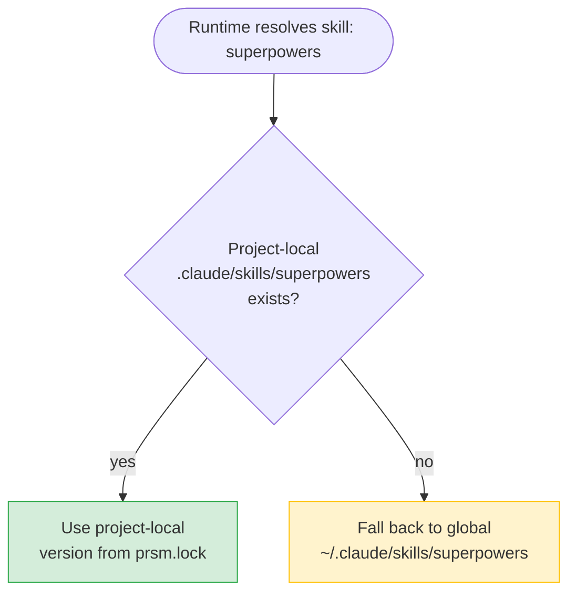

# 03 — Dependency Resolution

prsm uses a lockfile-based dependency model identical in intent to npm/Cargo: declare ranges in `prsm.yaml`, pin exact versions in `prsm.lock`, hydrate from locked state on every build.

## Adding a Dependency



## Installing from Lock (CI / New Machine)



## Lockfile Format

```yaml
# Auto-generated by prsm. Do not edit manually.
version: 1

superpowers:
  version: 5.1.0
  url: https://raw.githubusercontent.com/prsm-registry/skills/main/superpowers/5.1.0.tar.gz
  checksum: sha256:a3f9c2d8e1b047f3c9a2d5e8f1b4c7d0e3f6a9b2c5d8e1f4a7b0c3d6e9f2a5b8

claude-mem:
  version: 2.3.1
  url: https://raw.githubusercontent.com/prsm-registry/skills/main/claude-mem/2.3.1.tar.gz
  checksum: sha256:b7d1e4f7a0c3d6e9f2a5b8c1d4e7f0a3b6c9d2e5f8a1b4c7d0e3f6a9b2c5d8e1
```

- `version: 1` — index schema version; allows future migration without breaking existing lockfiles
- `checksum` — sha256 of the tarball; prsm refuses to use a dep whose hash doesn't match

## Global vs. Project-Local Conflict

Both Claude Code and Codex resolve project-local skill directories before global installs.



prsm writes only to project-local output dirs. It never touches `~/.claude/skills/` or any global path.

`prsm doctor` surfaces mismatches for visibility:

```
prsm doctor

⚠  superpowers: global v5.0.0, project locked v5.1.0
   → project-local wins in this workspace (expected)
   → other repos using global may see different behavior

✓  claude-mem: global v2.3.1, project locked v2.3.1 (in sync)
```

## Version Range Resolution

prsm uses standard semver range semantics:

| Range | Meaning | Example resolves to |
|-------|---------|---------------------|
| `^5.1.0` | Compatible with 5.x.x ≥ 5.1.0 | `5.3.2` |
| `~5.1.0` | Approximately 5.1.x | `5.1.7` |
| `5.1.0` | Exact | `5.1.0` |
| `*` | Latest | `6.0.0` |

Resolution always pins to the highest satisfying version available in the registry at the time `prsm add` runs. The lockfile then freezes that exact version — `prsm build` and `prsm install` never re-resolve.
