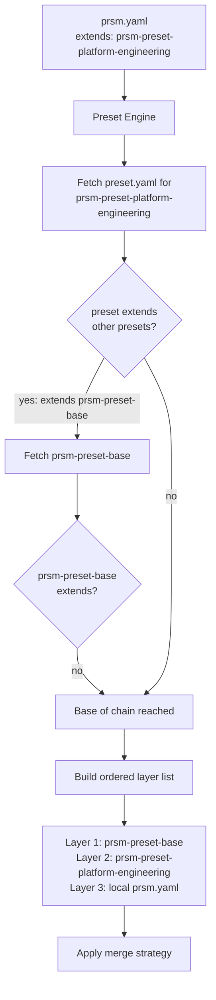
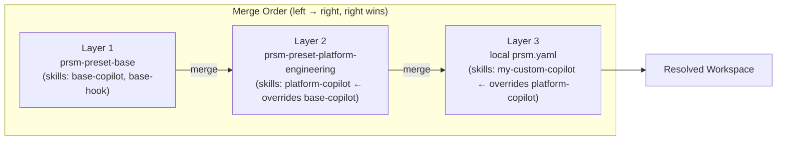
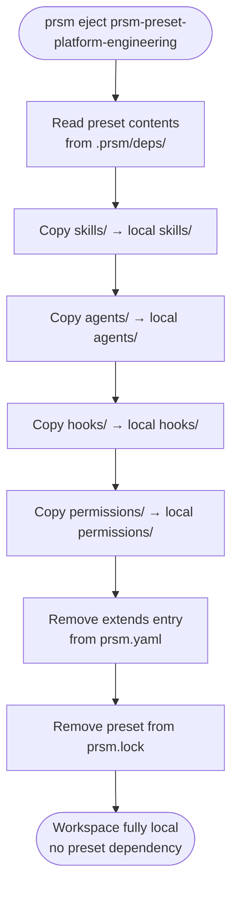

# 04 — Preset System

A preset is a named, versioned bundle of skills + agents + hooks + permission configs that teams share. The preset system is prsm's community flywheel — like ESLint shareable configs or Babel presets.

## What a Preset Bundles

```
prsm-preset-platform-engineering/
  preset.yaml          # metadata + extends chain
  skills/
    platform/copilot/
      SKILL.yaml
      SKILL.md
    security/stride/
      SKILL.yaml
      SKILL.md
  agents/
    pr-reviewer/
      AGENT.yaml
      AGENT.md
  hooks/
    pretool-safety.sh
    session-start.sh
  permissions/
    allowlist.yaml     # safe Bash patterns to pre-approve in settings.json
```

## Extends Chain Resolution

Presets can extend other presets. prsm resolves the full chain before merging.



## Merge Strategy

Last layer wins on name conflict. Resolution is deterministic and inspectable.



### Merge rules by primitive

| Primitive | Merge behaviour |
|-----------|----------------|
| Skills | Same name → later layer wins entirely |
| Agents | Same name → later layer wins entirely |
| Hooks | Same event (e.g. `pre-tool-use`) → later layer wins |
| Permissions | Additive — all allowlists combined |

## Consuming a Preset

```yaml
# prsm.yaml
extends:
  - prsm-preset-platform-engineering@^2.0.0
  - my-org/prsm-preset-internal@1.0.0   # private registry

# local skill overrides preset on name conflict
skills:
  - path: skills/custom/my-copilot
```

## Ejecting a Preset

`prsm eject [preset-name]` copies preset internals into the local `skills/`, `agents/`, and `hooks/` directories. After ejecting:
- The `extends:` entry is removed from `prsm.yaml`
- All skill files are locally owned
- No more preset dependency in `prsm.lock`



Eject is the escape hatch that makes preset adoption low-risk. Teams can always take full ownership.

## Community Conventions

```
prsm-preset-<name>           # naming convention for all published presets
prsm-presets/                # GitHub org for official community presets
my-org/prsm-preset-<name>    # private org presets via private registry
```

```
prsm search --presets              # list all available presets
prsm search --presets platform     # filter by keyword
prsm explain platform-copilot      # show which preset/layer the skill came from
```
