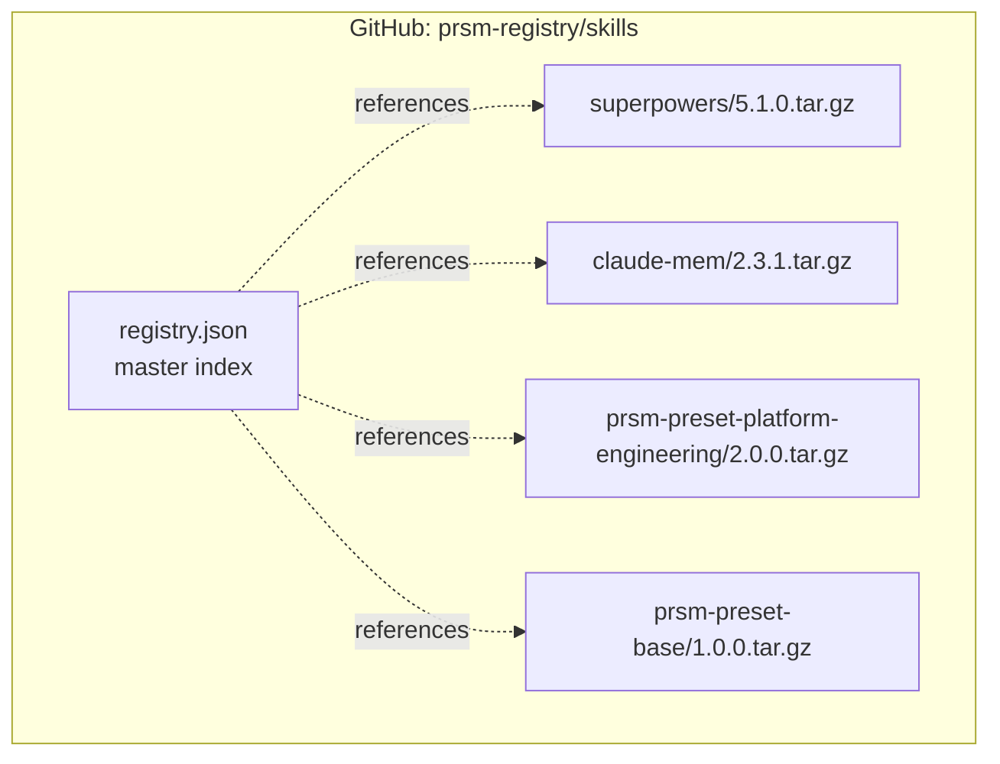
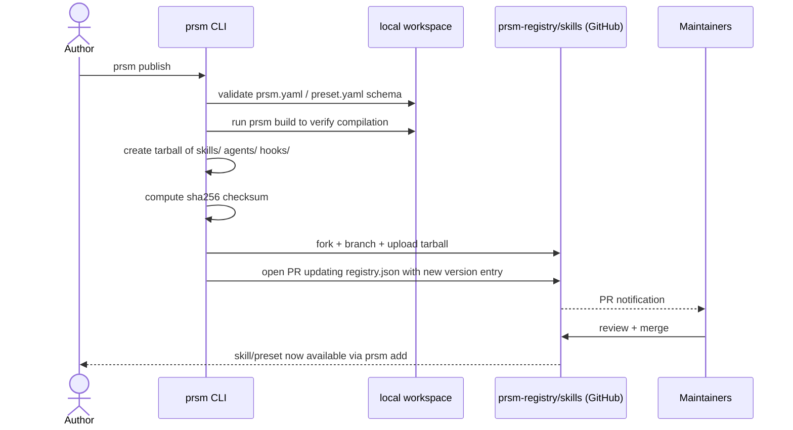
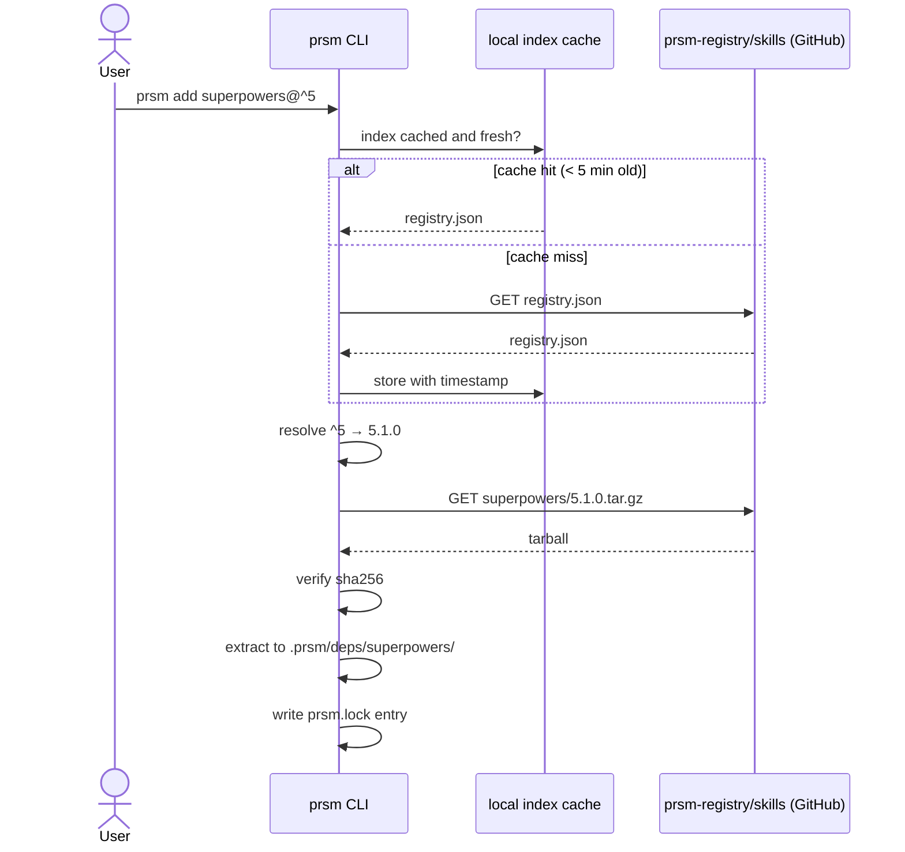

# 05 — Registry Architecture

prsm v1 uses a GitHub-backed registry: no custom backend, no auth infrastructure, no servers to operate.

## Structure



## Index Format

`registry.json` is the single entry point for all lookups.

```json
{
  "version": 1,
  "skills": {
    "superpowers": {
      "description": "Claude Code superpowers skill library",
      "author": "v1-io",
      "repository": "https://github.com/v1-io/v1tamins",
      "versions": {
        "5.0.0": {
          "url": "https://raw.githubusercontent.com/prsm-registry/skills/main/superpowers/5.0.0.tar.gz",
          "checksum": "sha256:...",
          "published": "2026-04-01T00:00:00Z"
        },
        "5.1.0": {
          "url": "https://raw.githubusercontent.com/prsm-registry/skills/main/superpowers/5.1.0.tar.gz",
          "checksum": "sha256:a3f9c2...",
          "published": "2026-05-01T00:00:00Z"
        }
      },
      "latest": "5.1.0"
    }
  },
  "presets": {
    "prsm-preset-platform-engineering": {
      "description": "Full platform engineering setup",
      "versions": { ... },
      "latest": "2.0.0"
    }
  }
}
```

`version: 1` at the root is the schema version — allows prsm to migrate to a real API backend later without invalidating existing `prsm.lock` files.

## Publishing Flow

Publishing = opening a PR. No credentials required beyond GitHub write access to the registry repo.



## Consuming Flow



## Private Registries

Teams can host their own registry by pointing `prsm.yaml` at a different index URL:

```yaml
registry:
  url: https://raw.githubusercontent.com/my-org/prsm-registry/main/registry.json
```

The index format is identical — prsm doesn't distinguish between public and private registries. Authentication is handled by GitHub (private repos require a token in `PRSM_REGISTRY_TOKEN` env var).

## Migration Path to Custom Backend

When the GitHub-backed model becomes a bottleneck (rate limits, large tarballs, complex auth), the migration path is:
1. Deploy an API that serves the same `registry.json` schema at a new URL
2. Update `registry.url` in `prsm.yaml` or the prsm default config
3. Existing `prsm.lock` files remain valid — they contain absolute tarball URLs, not registry-relative paths

The `version: 1` field in the index signals that the schema contract is stable.
