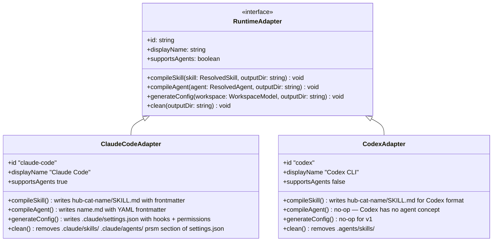
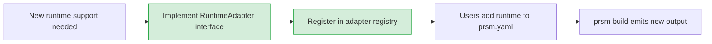

# 06 — Runtime Adapters

Adapters are the only runtime-specific code in prsm. Everything upstream (manifest parsing, dependency resolution, preset merging) is runtime-agnostic. An adapter takes the resolved `WorkspaceModel` and writes the target runtime's expected file structure.

## Adapter Interface



## Claude Code Adapter

### Skill output

Input: `skills/platform/copilot/SKILL.yaml` + `skills/platform/copilot/SKILL.md`

Output: `.claude/skills/hub-platform-copilot/SKILL.md`

```markdown
---
name: platform-copilot
description: Routes platform work to the right workflow
triggers:
  - dispatch work
  - route to skill
  - platform-copilot
tools:
  - Read
  - Write
  - Bash
  - Grep
---

[SKILL.md content verbatim]
```

Naming convention: `hub-<category>-<name>` — mirrors platform-hub's existing pattern so prsm-managed repos look identical to hand-crafted ones.

### Agent output

Input: `agents/pr-reviewer/AGENT.yaml` + `agents/pr-reviewer/AGENT.md`

Output: `.claude/agents/pr-reviewer.md`

```markdown
---
name: pr-reviewer
description: Deep pull-request reviewer with platform context
model: claude-sonnet-4-6
color: purple
tools:
  - Read
  - Bash
  - Grep
  - Glob
---

[AGENT.md content verbatim]
```

### Config output

`.claude/settings.json` — hooks section generated from `prsm.yaml` hooks block + permissions from preset `allowlist.yaml`:

```json
{
  "hooks": {
    "SessionStart": [{ "command": "hooks/session-start.sh" }],
    "PreToolUse": [{ "command": "hooks/pretool-safety.sh", "matcher": "Bash" }],
    "Stop": [{ "command": "hooks/session-stop.sh" }]
  },
  "permissions": {
    "allow": ["Bash(git *)", "Bash(gh *)", "Bash(make *)"]
  }
}
```

prsm writes only to a `prsm`-managed section of `settings.json`, leaving any existing user-authored sections untouched.

## Codex Adapter

### Skill output

Input: `skills/platform/copilot/SKILL.yaml` + `skills/platform/copilot/SKILL.md`

Output: `.agents/skills/hub-platform-copilot/SKILL.md`

Format mirrors the Claude Code skill output — Codex reads the same frontmatter-prefixed markdown. Any Codex-specific fields in `SKILL.yaml` under `codex:` key are merged into the frontmatter.

### Agents

Codex has no equivalent to Claude Code subagents. `compileAgent()` is a no-op. The adapter logs a warning if agents are declared but the only runtime is `codex`.

## Adding a New Runtime

Adding support for a new AI runtime (e.g. Gemini CLI, OpenAI Agents SDK) requires:

1. Create `src/adapters/<runtime-id>.ts` implementing `RuntimeAdapter`
2. Register it in `src/adapters/index.ts`
3. Document expected output format in this file

No changes to the compiler, resolver, preset engine, or manifest format.



The compiler discovers adapters by `id` at build time — it iterates `workspace.runtimes`, looks up each adapter by id, and dispatches. Unknown runtime id → error with list of registered adapters.
